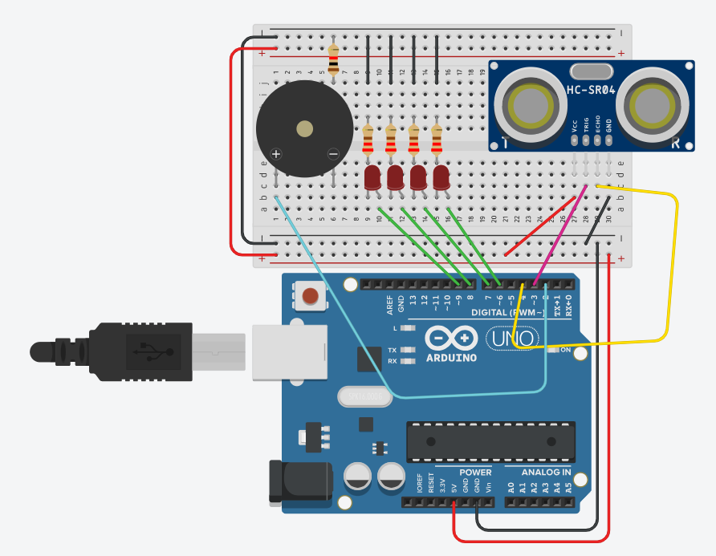

# 5. Development of Embedded & Real-Time Systems

I attended this course in `January - March 2024` and coded in a group with 2 other students. We were given 6 coding assignments denoted as *Work Packages* with an extra submission for each package to get bonus points, followed with a joint presentation with the University's teaching assistants. These tasks concerned aspects of C and C++ programming as well as Tinkercad, and ultimately in the end of the course it extended to replacing what we simulated in Tinkercad with real hardware reliable components. Fortunately, I had previous experience with C and C++ with Arduino in the following projects:

- [Problem Solving, C-Programming](https://gitlab.com/jex-projects/mrjex/-/tree/main/problem-solving/3.%20C-Programming?ref_type=heads)

- [Systems Development](https://gitlab.com/jex-projects/mrjex/-/tree/main/projects/1.%20courses/year-1/7.%20Systems%20Development/WioPlay/seeed-wio-terminal/WioPlay?ref_type=heads)

## Pointers

A pointer is a variable that stores the memory address of another variable as its value. This is usually a confusing concept for people getting started with C or C++. My first real assigned task with pointers can be found in `/code/workpackages/exercise4`. Furthermore, my first *Bonus Point* assignment involving pointers is located in `/code/bonus-points/bp-1`, and the vast majority of my spare time projects in `/code/spare-time-practice` are based on pointers.

### Function Pointers

Since the conceptual idea of pointers is so simplistic (storage of memory address tied to a value), it is generalized to sub-branches and can be applied in many different forms. For instance, being able to point functions is made possible. In `/code/workpackages/WP2/E1` me and my group's application of this particular kind of pointers can be seen.

### Sorting

As an exercise to get accustomed to pointers and their efficiency, we were tasked to program **Bubble Sort** and **Selection Sort** with a swapping function. Have a look at `/code/workpackages/WP4/E4` for more information. In [Data Structures & Algorithms](https://gitlab.com/jex-projects/mrjex/-/tree/main/projects/1.%20courses/year-1/5.%20Data%20Structures%20&%20Algorithms?ref_type=heads) I learned about these sorting algorithms as well as **Quick Sort** and **Merge Sort**.

## Memory Allocation

In C programming, there are two important terms:

**Dynamic Memory Allocation:** Allocate memory during run-time using using `malloc()` or `calloc()`. The important thing to keep in mind is that for each new memory allocation, the datatype must be specified and the number of such instances you want to add to the memory. In cases where you are dealing with customized datatypes such as structs, you must specify the struct.

**Static Memory Allocation:** Allocate memory before the script is being executed. Always a fixed value and garantees to possibility for memory leaks to the heap.

## Bitwise Operators

I also learned how to perform actions on bits, using a base-2 system. I practiced these operators a lot in `/code/spare-time-practice`, and applied the knowledge in several workpackages. It's also worth noting that these kind of operators were used in `/code/workpackages/WP2/E4` to convert numbers between bases in a pipeline of two **.c** files in the following sequence:

- *decimal --> binary --> hexadecimal*

## Local Database File

In one of the exercises in a workpackage, we were required to store information in a **.bin** file and depending on the user's interactions, delete, override, add or modify, retrieve all instances or retrieve filtered instances. This binary database stored *Persons*, which I created a struct for that in turn stores 3 distinct strings (character arrays) for first name, last name and id. Have a look at `/code/workpackages/WP2/E3` for more information.

## Linked Lists

Using the basic principle of pointers and their ability to point to a memory address, we can turn it into a *Linked List* data structure with easy. In a few of my practice-sessions and workpackages I used customized datatypes of structs with pointers and letting them point to other struct objects. Have a look at `/code/WP2/E2` for more information. My other experiences with linked lists can be seen below:

- [Data Structures & Algorithms](https://gitlab.com/jex-projects/mrjex/-/tree/main/projects/1.%20courses/year-1/5.%20Data%20Structures%20&%20Algorithms?ref_type=heads)

- [Problem Solving, C-Programming, Linked Lists](https://gitlab.com/jex-projects/mrjex/-/tree/main/problem-solving/3.%20C-Programming/linked-lists?ref_type=heads)

## TinkerCad & Hardware

In the later workpackages *(3-6)*, as we had gained knowledge of the basic fundamentals of C-programming, we were introduced to TinkerCad tasks, and eventually we had the chance to use hardware to simulate our programmed systems independent of any software interactions.

Work Package 5:

Work Package 6:

Take a deeper look into the workpackages in `/code/workpackages`