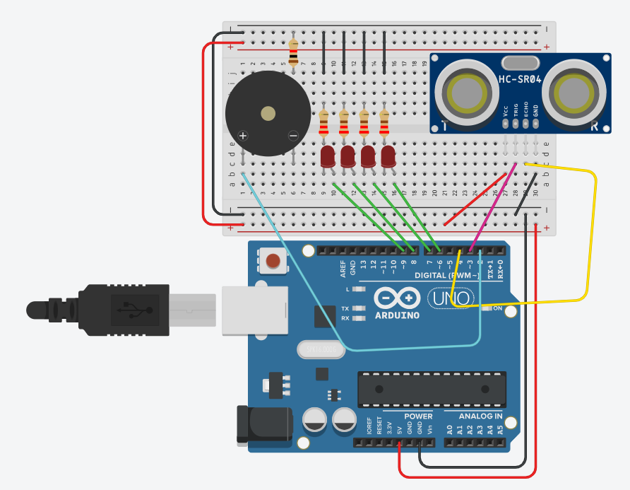

# Embedded & Real-Time Systems

> Development of systems using C, C++ and Tinkercad, by Nasit Vurgun, Mohamad Khalil and Joel Mattsson

)

## Table of Contents
- [Embedded \& Real-Time Systems](#embedded--real-time-systems)
  - [Table of Contents](#table-of-contents)
  - [Overview](#overview)
  - [Hardware Integration](#hardware-integration)
    - [TinkerCad Simulation (Work Packages 3-6)](#tinkercad-simulation-work-packages-3-6)
    - [Work Package 5 Demo](#work-package-5-demo)
    - [Work Package 6 Implementation](#work-package-6-implementation)

## Overview

This project was developed during January - March 2024 in collaboration with two other students. The course consisted of 6 comprehensive work packages focusing on:
- Advanced C/C++ programming concepts
- TinkerCad simulation
- Hardware implementation
- Real-time system development

## Hardware Integration

### TinkerCad Simulation (Work Packages 3-6)
Progressive development from software to hardware:
- Circuit design
- Component integration
- Real-time simulation

### Work Package 5 Demo

### Work Package 6 Implementation
Circuit Design:

Live Demo:

